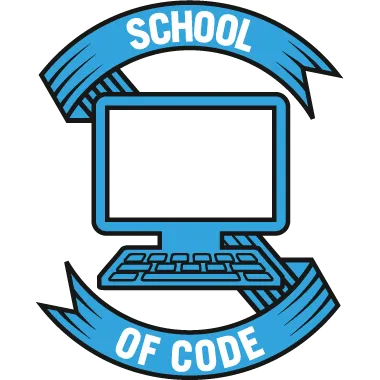

<iframe src="https://onedrive.live.com/embed?cid=2E3A76ABA53A4AED&resid=2E3A76ABA53A4AED%211376&authkey=APWT4FAKcb8VQBU&em=2" width="402" height="327" className={styles.powerpoint}></iframe>

<h1>
Hi there 👋
</h1>

🌱 I’m currently learning with [School Of Code:](https://www.schoolofcode.co.uk/)

[Home Page](https://lucy-de-rojas.github.io/Lucy-de-Rojas/)
[Next Home Page](https://lucy-de-rojas.vercel.app/)

<!--
**Lucy-de-Rojas/Lucy-de-Rojas** is a ✨ _special_ ✨ repository because its `README.md` (this file) appears on your GitHub profile.

Here are some ideas to get you started:

- 🔭 I’m currently working on ...
- 🌱 I’m currently learning ...
- 👯 I’m looking to collaborate on ...
- 🤔 I’m looking for help with ...
- 💬 Ask me about ...
- 📫 How to reach me: ...
- 😄 Pronouns: ...
- ⚡ Fun fact: ...
-->

  

